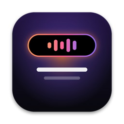
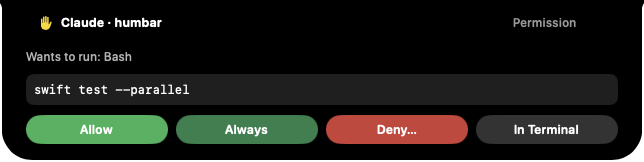
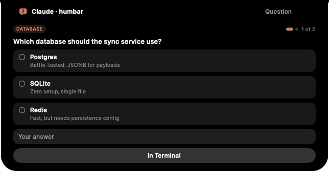
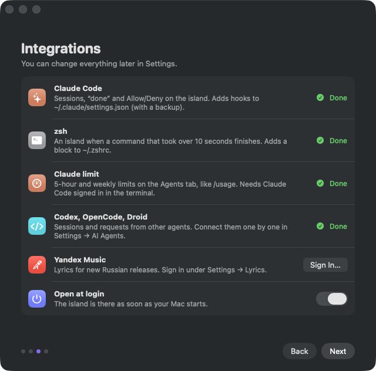

# Humbar

**Your MacBook’s notch, turned into a Dynamic Island.** 
Synced lyrics, notifications, a hub of everyday tools — and your AI coding agents asking for permission right next to the camera.

[**Download**](https://github.com/ItsDarkEzz/humbar/releases/latest) · [Website](https://humbar.app) · **English** · [Русский](README.ru.md)

 

## Why Humbar

The notch is the one place on your screen you always glance at and never use. Humbar makes it the calm center of your Mac: what’s playing and the words being sung, the message that just arrived, the timer that’s running — and when Claude Code, Codex, OpenCode or Droid needs a decision, the question appears right there, so you can answer without hunting for a terminal tab.

Try every feature free for 7 days, then keep it for **$3.99, once** — no subscription, no account, every update included. There is no Humbar server: nothing about you leaves your Mac except what a feature clearly needs.

## Features

<table>
<tr>
<td width="50%" valign="top">

### 🎵 Music & synced lyrics
Works with any player — Yandex Music, Spotify, Apple Music, a song in a browser tab. Lyrics come from **Yandex Music**, **LRCLIB**, **NetEase** and **Kugou**, so even fresh Russian releases are covered. Words light up one by one when the source has word timings. The island takes on the album art’s colors; the equalizer can follow the real system audio.

</td>
<td width="50%" valign="top">

### 🤖 AI agents in the notch
**Claude Code**, **Codex**, **OpenCode** and **Droid**. Allow, Always or Deny with a comment, with a diff preview for edits. Answer an agent’s multiple-choice questions one by one. Review a Markdown plan and approve it or ask for changes. Track Claude’s 5-hour and weekly limits, with a heads-up at 80 % and 95 %. While you are in the agent’s own window its requests stay off the island, and one you answer there leaves the island at once. Each agent can have a **pet** that stands beside the island, on either side, and acts out what the agent is doing — Humbar’s own Hum, any pet in the open Codex pet format, or one from the codex-pets.net community list.

</td>
</tr>
<tr>
<td valign="top">

### 💬 Notifications
Telegram and other messengers arrive as island cards. Click to reply without leaving what you’re doing; double-click to open the app.

</td>
<td valign="top">

### 🧰 The hub
Hover over the notch or swipe down with two fingers: now playing, calendar and reminders, weather, a file shelf with AirDrop, clipboard history with on-device text recognition, timer, notes, Shortcuts, stocks, a camera mirror and your devices’ battery. ⌃⌥K opens the command palette.

</td>
</tr>
<tr>
<td colspan="2" valign="top">

### ✨ Small islands
Charging, Caps Lock, Focus, finished downloads, drives with an Eject button, AirPods, calls, long zsh commands — and volume and brightness in the notch instead of the system overlay.

</td>
</tr>
</table>

## Install

1. Download **`Humbar-<version>.dmg`** from [Releases](https://github.com/ItsDarkEzz/humbar/releases/latest) — every feature is free for 7 days.
2. Drag Humbar to **Applications** and open it.
3. Humbar isn’t signed with an Apple Developer ID yet, so macOS warns on the first launch. Open **System Settings → Privacy & Security** and click **Open Anyway** — once.

The welcome window then walks you through permissions and integrations. Everything it needs is bundled. Requires **macOS 15.4+** on **Apple Silicon**. The interface is in English and Russian and follows your system language (you can switch it in Settings → System).

## Connect your agents

Open **Settings → AI Agents** and click **Connect** next to each agent you use.

| Agent | How it connects | On the island |
|---|---|---|
| Claude Code | HTTP hooks in `~/.claude/settings.json` | sessions, permissions, questions, plans, “done” |
| Codex | command hooks in `~/.codex/hooks.json` (trust them once in `/hooks`) | sessions, permissions |
| OpenCode | a plugin in `~/.config/opencode/plugins` | sessions, permissions with “Always”, questions |
| Droid | command hooks in `~/.factory/settings.json` | sessions, “done”, “needs permission” |

Every file is backed up before it changes, and **Disconnect** removes exactly Humbar’s entries. If Humbar isn’t running, agents behave as if it weren’t installed.

## Privacy

- **No Humbar server, no analytics, no Keychain.**
- Lyrics sources receive only the track title, artist and duration. Lyrics aren’t saved to disk.
- Agent hooks talk only to `127.0.0.1:47431`, protected by a random per-install token.
- The community pet list (optional) is requested from `codex-pets.net` only when you press Browse in Settings; installing a pet downloads its package from there. The pets are third-party work, not part of Humbar.
- The Claude limit (optional) reads Claude Code’s own sign-in from `~/.claude/.credentials.json` and asks `api.anthropic.com` for your usage.
- The Yandex sign-in lives in `~/Library/Application Support/Humbar/yandex.json`, readable only by your user.

## FAQ

<b>How much does it cost?</b>

$3.99, once. Every feature is free for 7 days; after that the island asks for a licence key, which you get on [humbar.app/buy](https://humbar.app/buy/). All updates are included, and the key works offline.

<b>Why does macOS say it can’t verify the developer?</b>

The app isn’t notarized with an Apple Developer ID yet. Open **System Settings → Privacy & Security** and click **Open Anyway** — once.

<b>Does it work on Macs without a notch?</b>

Humbar is designed for MacBooks with a notch. On other screens the island sits at the top center, but the experience is built around the notch.

<b>Will it fight with other notch apps?</b>

Use one notch app at a time — they all draw in the same place.

<b>Which parts rely on unofficial APIs?</b>

Now Playing uses Apple’s private MediaRemote framework through the bundled [media-control](https://github.com/ungive/media-control). The Yandex Music sign-in presents itself as the Yandex Music Android client, as the open-source [yandex-music-api](https://github.com/MarshalX/yandex-music-api) does. The Claude usage endpoint is undocumented, and NetEase, Kugou and Yahoo quotes are unofficial. Any of these can change without notice.

## Buy

Humbar is **$3.99, once** — see [humbar.app/buy](https://humbar.app/buy/). Pay with USDT and your licence key appears on the same page; paste it in **Settings → License**.

## Support

Found a bug or have an idea? [Open an issue](https://github.com/ItsDarkEzz/humbar/issues) or write to [hello@humbar.app](mailto:hello@humbar.app). What changed in each version: [CHANGELOG.md](CHANGELOG.md).

---

© 2026 Humbar. All rights reserved. Bundled: [media-control](https://github.com/ungive/media-control) (BSD-3-Clause), [Yams](https://github.com/jpsim/Yams) (MIT).
Humbar is not affiliated with Apple, Anthropic, OpenAI, Yandex, Spotify or LRCLIB.
